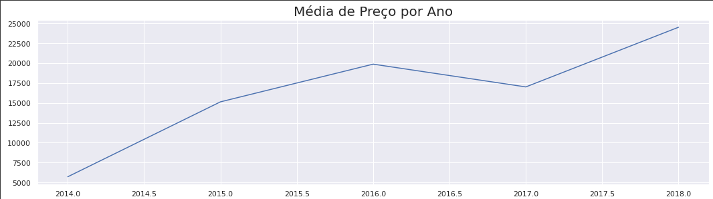
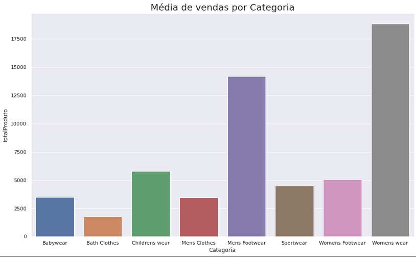
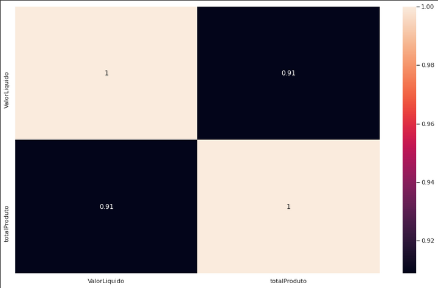

# Questão de negócio

O objetivo deste projeto é analisar os dados e em seguida responder as perguntas propostas e também descobrir novos insights. As perguntas são: 
- Do que se trata o negócio por trás dos dados? 
- A performance de vendas tem melhorado ao longo dos anos? 
- Existe algum tipo de sazonalidade no ano? 
- Algum cliente tem maior relevância de vendas? 
- Existe funcionários sem venda? Por que ?
- Quais categorias de produto vendem mais? Isso é um padrão em todos os países? 
- Existe relação entre o preço e o volume de vendas de um produto? 
  
# Estratégia da Solução

O produto final será um arquivo .csv agrupado com os campos necessários para a análise e um dashboard feito no PowerBI Desktop. 

## Ferramentas
 

  <ul>
    <li><a href="https://www.python.org/">Python 3.9</a></li>
    <li><a href="https://jupyter.org/">Jupyter Notebook</a></li>
    <li><a href="https://powerbi.microsoft.com/pt-br/">PowerBI Desktop</a></li>
    <li>Metodologia CRISP-DM</li>
  </ul>
 

## Procedimentos
- Coletar os dados; 
- Realizar a Limpeza dos Dados: tratar dados faltantes, outliers, duplicidades, etc;
- Derivar algumas variáveis (mês que a venda foi realizada por exemplo); 
- Realizar a análise exploratórios: descobrir novos insights; 
- Responder as perguntas propostas. 
  

# Solução

Respondendo as perguntas do projeto: 

### <b>Do que se trata o negócio por trás dos dados? </b>

- Os dados apresentam os registros de vendas de uma rede de lojas. Essa rede de lojas possui escritórios em 5 cidades ( Stockholm, Lund, Paris, Nice, Seattle).
- Essa rede vende diversos produtos de vestuário para as regiões da América do Norte, América do Sul e Europa.
- Seus fornecedores também são de diferentes partes do mundo, inclusive do Japão, mesmo não existindo venda no continente asiático.
- E também seus clientes (ao todo 90) são diferentes partes do mundo.

### <b>A performance de vendas tem melhorado ao longo dos anos?</b> 

- Vamos observar nos gráficos abaixo que o aumento das vendas foi sim crescente. Mas houve uma queda em 2017(-14% relacionado ao ano de 2016), porém em 2018 o aumento foi de 44%. 

  
### <b>Existe algum tipo de sazonalidade no ano?</b>

- A sazonalidade que existe no ano é que a maior concentração de vendas está na Europa. E a principal categoria vendida pra essa região é a de Sportwear. 

### <b>Algum cliente tem maior relevância de vendas?</b> 

- Ao analisar a média de vendas para cada cliente, se destaca o cliente Sunny Ski Store e Grunewald;
- Porém ao analisar quantas vezes esses clientes compraram, a Sunny Ski fez pouquíssimas compras, ao contrário da Grunewal. Nesse quesito se destaca o cliente Boleros;
- Por fim o ideal é somar o total de compras realizadas pelos clientes, e então se destaca Grunewald, que tem uma média considerável, realizou diversas compras e no totalizador é o que mais comprou. 

### <b>Existe funcionários sem venda? Por que ?</b> 

- Sim, vários funcionários não possuem vendas pelo fato de seus cargos não serem relacionados a vendas, logo os mesmos também não possuem metas de venda.

### <b>Quais categorias de produto vendem mais? Isso é um padrão em todos os países?</b> 

- As categorias Womens Wear e Mens Footwear são as que possuem maior média de vendas. Porém de acordo com o segundo gráfico, não é correto dizer que esse é o padrão em todos os países.

  

### <b>Existe relação entre o preço e o volume de vendas de um produto?</b> 

- Como se pode observar abaixo nessa matriz de correlação de Pearson, existe sim uma relação forte entre o preço do produto e seu volume de vendas.

  
# Novos Insights sobre o negócio

- <b>A média de vendas na Europa é 25% maior.</b>
    - O gráfico mostra que a média de venda na América do Norte comparada com a Europa é 25% menor. Então essa hipótese é VERDADEIRA.
  

- <b>A média de vendas na américa do Sul é 20% maior no Brasil.</b>
    - Falsa: Como mostra o gráfico, a média de vendas no Brasil é 770% maior.
  

- <b>Funcionários do escritorio 3 vendem 15% a mais, na média.</b>
    - Falsa: O escritório 3 possui a menor média de vendas
  

- <b>A média de vendas aumenta 10% a medida em que a meta aumenta.</b>
    - Falsa: não existe crescimento linear nesse caso, pelo contrário, a maior média de vendas está concentrada em vendedores com meta de 320.000.
  

- <b>A média de vendas da categoria Sportwear é 30% maior.</b>
    - Falsa: as categorias que se destacam no quesito de média de vendas são: Childrens wear, Mens Footwear, Womens wear.
  

- <b>A média de vendas de produtos dos fornecedores do Reino Unido é 10% maior.</b>
    - Falsa: a média de vendas de produtos dos fornecedores de UK é uma das menores .
  

- <b>A média de vendas do ano 2016 aumentou 20%.</b>
    - Falsa: na verdade a média para esse ano aumento 31% comparado ao ano 2015.
  

- <b>A média de vendas é maior no final de semana.</b>
    - Verdadeira: Outro fato é que a média para os dias de domingo é maior que a média para terça,quarta e quinta.

